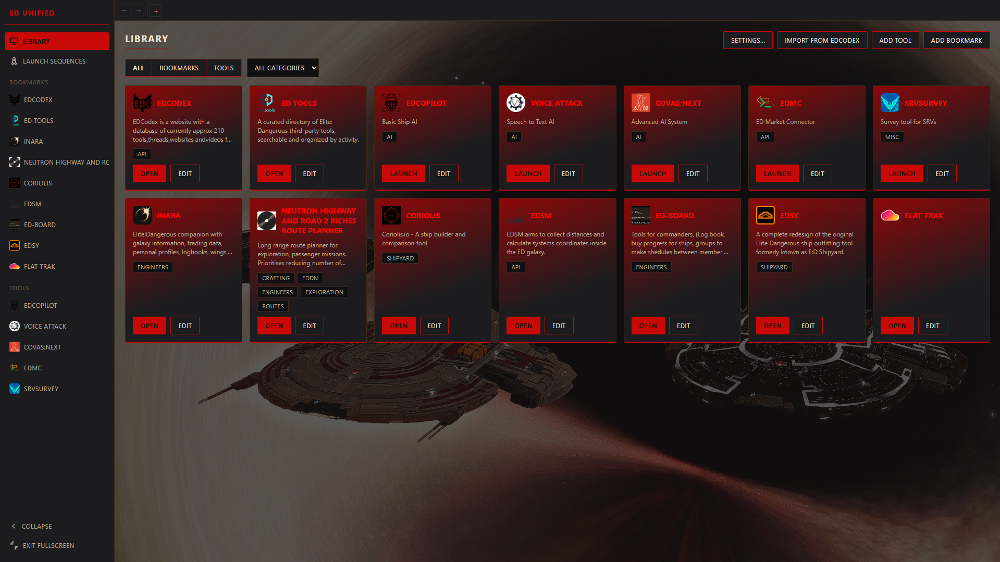
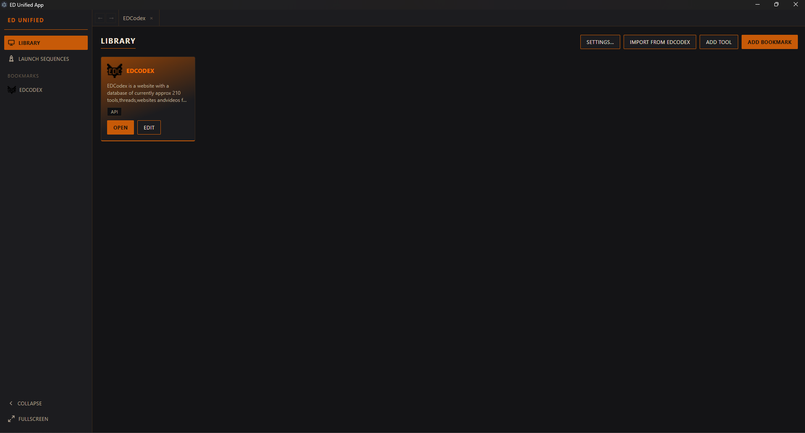
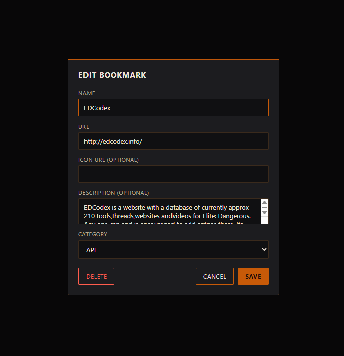
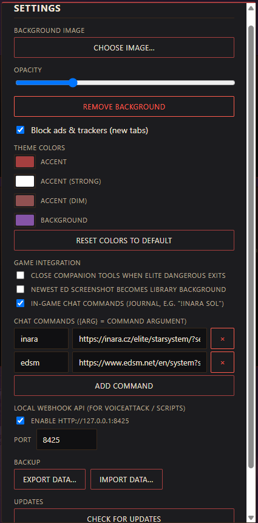

# ED Unified

A desktop app for Windows and Linux that unifies browsing, bookmarking, installing, and launching Elite: Dangerous third-party tools -- so you never need to leave it for your regular web browser.

Browse and bookmark EDCodex tools, launch filesystem programs, chain everything (game + companion apps) into one launch sequence, and theme every embedded site with an Elite Dangerous-inspired HUD look, all from a single app.

## Features

- **Unified library** -- bookmarks and filesystem tools live side by side in one grid, drag-and-drop to reorder, organized by category with type and category filters. [EDCodex](http://edcodex.info/) and [ED Tools](https://ed.tools/) come pre-bookmarked.
- **In-app browsing** -- embedded sites open as tabs inside the app (with back/forward navigation), never in your OS browser. Open a blank tab with the "+" button and browse anywhere from its URL bar; blank tabs use your library background as their default page.
- **Find in page** -- Ctrl+F opens a find bar on any website tab, with match counts and previous/next navigation.
- **Download manager** -- downloads from embedded sites are tracked in a Downloads panel with progress, speed, ETA, and destination folder, plus an optional "Launch when done" that runs the file (e.g. an installer) as soon as it finishes.
- **One-click EDCodex import** -- paste an EDCodex tool URL, or click "Add to ED Unified" directly on an EDCodex tool page while browsing it inside the app, and the name, description, categories, and icon all come across automatically. Works for web apps (imported as bookmarks) and Windows tools (imported as filesystem tools via the EDCodex API, with a guided download-and-link flow).
- **Launch sequences** -- chain a game launch (Steam/Epic/direct) with companion tools and custom delays, then generate a launch script (`.bat` on Windows, `.sh` on Linux) or run it straight from the app.
- **Auto dark theming** -- per-site brightness/contrast/sepia controls with a smart auto-invert for bright pages, plus legacy one-click presets.
- **Custom library background** -- set your own background image with adjustable opacity behind the library grid.
- **Game overlay** -- pin any tab as a floating always-on-top window (with opacity control) over Elite in borderless-windowed mode.
- **Game-aware automation** -- optionally auto-close companion tools when the game exits, trigger pages from in-game chat commands (`!inara Sol`), and set each new ED screenshot as the library background.
- **Tool update badges** -- tools imported from EDCodex get an update badge when a newer version is listed.
- **Backup & restore** -- export/import your entire library and settings as one JSON file.
- **Local webhook API** -- drive the app from VoiceAttack or scripts over localhost (see below).
- **Built-in ad/tracker blocking** for embedded tabs.
- **Fully customizable theme colors** and a collapsible sidebar.
- **Fullscreen/borderless mode** for a clean, distraction-free layout.

## Screenshots

### A customized setup -- custom theme colors, background image, and icons


### Library (default look)


### Import from EDCodex


### Add to ED Unified directly from an EDCodex tool page, with per-site dark theming


### Add / edit bookmarks



### Add a filesystem tool


### Launch sequences


### Settings


## Getting Started

### Download

Grab the latest release from the [Releases](../../releases) page:

- **Windows** -- `ED Unified-<version>-setup.exe` installer
- **Linux** -- `ED Unified-<version>.AppImage` (mark it executable, then run it)

### Build from source

Requires [Node.js](https://nodejs.org) 20+.

```sh
npm install
npm run dev            # run in development
npm run build:win      # build the Windows installer (release/)
npm run build:linux    # build the Linux AppImage (release/)
```

> Note: `build:linux` must run on Linux (AppImage assembly creates symlinks, which Windows blocks without elevation or Developer Mode). Pushing a `v*` tag builds both installers via GitHub Actions and attaches them to a draft release.

## Webhook API

Enable it in Settings (off by default; binds to `127.0.0.1` only, default port `8425`). Bookmarks and sequences match by id or name.

```sh
curl http://127.0.0.1:8425/status
curl -X POST http://127.0.0.1:8425/open-bookmark -d "{\"name\": \"INARA\"}"
curl -X POST http://127.0.0.1:8425/open-url -d "{\"url\": \"https://coriolis.io\"}"
curl -X POST http://127.0.0.1:8425/run-sequence -d "{\"name\": \"Full Stack\"}"
curl -X POST http://127.0.0.1:8425/refresh-tab
curl -X POST http://127.0.0.1:8425/show-library
```

## Tech Stack

Electron, React, TypeScript, and [lowdb](https://github.com/typicode/lowdb) for local storage -- no backend, no account. All your data (bookmarks, tools, sequences, settings) lives on your machine.

The app sends **anonymous usage statistics** via [Aptabase](https://aptabase.com) (a privacy-first analytics service): app opened/closed, feature usage counts, and crash reports. No URLs, file paths, tool names, or any personal data are ever included, and you can turn it off in Settings ("Share anonymous usage statistics").

## License

[MIT](LICENSE)
